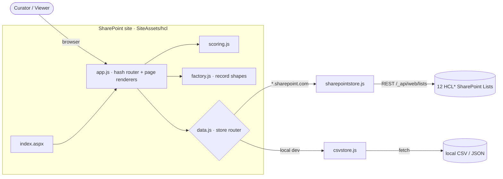

# Hackathon Content Library

> SLED AI Hackathons — capture, score & productionize.

A single hub for running **State &amp; Local Government (SLED) AI hackathons** end‑to‑end — from
registering the customer agency and planning the event, through capturing and scoring use cases,
to promoting the strongest ideas into a production pipeline and harvesting reusable patterns and
lessons learned.

It runs as a **zero‑build, vanilla‑JavaScript** single‑page app hosted directly on a **SharePoint
Online** site, persisting every record to SharePoint Lists via REST. No servers, no frameworks, no
build pipeline — upload the files and it works.

---

## Table of contents

- [What it does](#what-it-does)
- [Technical stack](#technical-stack)
- [Architecture](#architecture)
- [Repository structure](#repository-structure)
- [Quick start (local dev)](#quick-start-local-dev)
- [Deploy to SharePoint](#deploy-to-sharepoint)
- [Governance &amp; admin](#governance--admin)
- [Data &amp; privacy](#data--privacy)
- [Author](#author)

---

## What it does

| Area | Description |
|---|---|
| 🏛️ **Agencies &amp; decision makers** | Capture customer agencies and their primary contacts. |
| 📅 **Hackathons &amp; calendar** | Plan upcoming events and record past ones end‑to‑end. |
| 💡 **Use cases &amp; scoring** | Score ideas on a weighted production‑readiness framework. |
| 🚀 **Pipeline &amp; patterns** | Promote winners and reuse proven solution accelerators. |
| 🕓 **Audit &amp; governance** | One central trail of every change, with archive &amp; restore. |

Every record is form‑driven and persists to SharePoint Lists, so the program's knowledge compounds
across events instead of living in scattered decks and spreadsheets.

---

## Technical stack

| Layer | Detail |
|---|---|
| **Front end** | Vanilla JavaScript (ES modules), hash router, **zero build step** |
| **UI** | Hand‑rolled CSS design tokens — responsive cards, modals &amp; tables |
| **Data model** | Factory‑driven records (single source of truth in [`app/js/factory.js`](app/js/factory.js)) |
| **Persistence** | SharePoint Online Lists via REST (same‑origin `_api`); CSV store for local dev |
| **Scoring** | Weighted production‑readiness framework ([`scoring.js`](app/js/scoring.js)) |
| **Governance** | Per‑record audit trail, soft archive/restore, admin‑gated permanent delete |
| **Hosting** | SharePoint site (`SiteAssets`) — custom `.aspx` page pipeline |

> The same JS runs locally (CSV/sample modes) and on SharePoint (live Lists). The app
> **auto‑detects** its host: any `*.sharepoint.com` origin switches it to live‑Lists mode.

---

## Architecture



The full step‑by‑step provisioning and deployment runbook is in
**[`SharePoint_Deployment_Steps.md`](SharePoint_Deployment_Steps.md)**, and a deeper architecture
walkthrough (data flow, scoring, governance) is in **[`docs/ARCHITECTURE.md`](docs/ARCHITECTURE.md)**.

---

## Repository structure

```
hackathon-content-library/
├─ app/                          # 👉 What you deploy to SharePoint (SiteAssets/hcl)
│  ├─ index.aspx                 #    App page (renders inline on SharePoint)
│  ├─ css/styles.css
│  └─ js/                        #    ES modules — upload the whole folder together
├─ scripts/
│  └─ provision-via-sitedesign.ps1   # Creates the 12 Lists with correct internal names
├─ lists/                        # Column reference + header-only CSV templates
├─ screenshots/                  # Images referenced by the deployment guide
├─ docs/
│  └─ ARCHITECTURE.md            # Architecture & data-flow diagrams
├─ SharePoint_Deployment_Steps.md    # Full deployment runbook
└─ archive/                      # Reference only — not deployed
   ├─ prototype/                 #    Original local-dev app + demo data
   └─ pilot-platform/            #    Schema, seed CSVs, manual setup notes
```

> **`app/` is the only folder you deploy.** `archive/` is kept for reference and history.

---

## Quick start (local dev)

The app is static — any local HTTP server works. A helper is included:

```powershell
# From the repo root
pwsh -File .\archive\prototype\serve.ps1
# then open http://localhost:8099/index.html
```

Useful URL modes (append to `index.html`):

| URL | Mode |
|---|---|
| `index.html` | Built‑in factory seed (in‑memory) |
| `index.html?data=sample` | Loads the JSON demo dataset in `archive/prototype/data/` |
| `index.html?data=csv` | CSV store mode |

No Node, npm, or build tools are required — it's plain ES modules served over HTTP.

---

## Deploy to SharePoint

Full instructions with screenshots: **[`SharePoint_Deployment_Steps.md`](SharePoint_Deployment_Steps.md)**.
The short version:

1. **Create the site** — a Communication site (Blank template).
2. **Allow custom scripts** (admin, persists via PowerShell):
   ```powershell
   Connect-SPOService -Url https://contoso-admin.sharepoint.com
   Set-SPOSite -Identity "https://contoso.sharepoint.com/sites/HackathonContentLibrary" -DenyAddAndCustomizePages $false
   ```
3. **Create the 12 Lists** with correct column internal names:
   ```powershell
   pwsh -File .\scripts\provision-via-sitedesign.ps1 `
        -SiteUrl "https://contoso.sharepoint.com/sites/HackathonContentLibrary"
   ```
   (Uses only the **SharePoint Online Management Shell** — no PnP, no Entra app, no browser console.)
4. **Upload the app** — put `app/index.aspx`, `app/css/`, and the **entire** `app/js/` folder into
   `SiteAssets/hcl/`.
5. **Verify** — browse `…/SiteAssets/hcl/index.aspx`, then do a write test (Register an Agency → Save).

> ### Two things that will bite you
> - **Use `index.aspx`, not `index.html`.** A raw `.html` file in a SharePoint library downloads
>   instead of rendering on most tenants. `.aspx` renders inline.
> - **The custom‑script flag auto‑reverts (~24h).** If the page suddenly returns
>   *"Sorry, something went wrong — File Not Found"* although the files are present, re‑run the
>   `Set-SPOSite -DenyAddAndCustomizePages $false` command from step 2.
> - **Always upload all JS together** — the modules import each other; a partial upload hangs the app
>   on *"Loading library…"*.

---

## Governance &amp; admin

- **Archive (soft delete)** — anyone with edit rights can archive a record; it leaves the catalog but
  is recoverable from the **Audit** page. Every archive/restore/delete is written to a central audit log.
- **Permanent delete** — reserved for admins. The app decides admin status from the **live site**: a
  user qualifies if they are a **site collection administrator** or a member of a SharePoint group
  named **`HCL Admins`** (configurable in [`app/js/spconfig.js`](app/js/spconfig.js)). The check
  **fails closed** — any error treats the user as non‑admin. See §7.1 of the deployment guide.

---

## Data &amp; privacy

- All sample/seed data in this repository is **fictional** — placeholder agencies, people, emails
  (`@example.gov`), and a placeholder tenant (`contoso`). No real customer, tenant, or personal data
  is included.
- The app stores data only in **your** SharePoint Lists, on **your** tenant. Nothing is sent anywhere
  else; all REST calls are same‑origin to the hosting site.
- Replace `contoso` / `HackathonContentLibrary` with your own tenant and site throughout the docs and
  the provisioning command.

---

## Author

**Anwar Shaikh** — designer &amp; builder of the Hackathon Content Library.
https://github.com/shaikhanwar/HackathonContentLibrary
