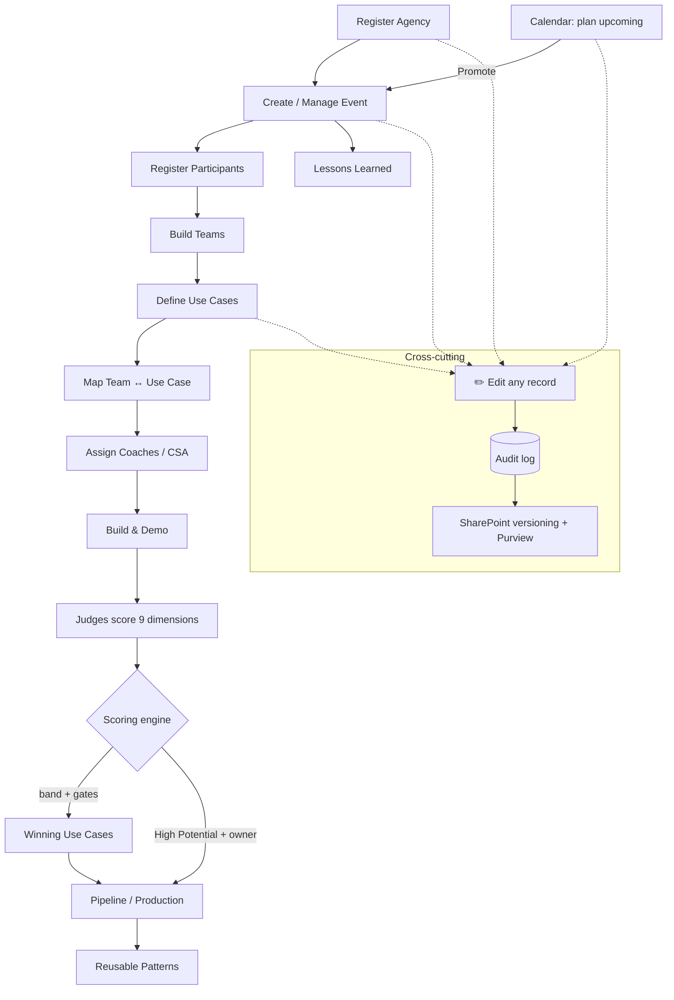

# Hackathon Content Library — Web Prototype

A zero-build, clickable prototype of the Hackathon Content Library. Vanilla HTML/CSS/JS, no dependencies, no build step. It implements the blueprint's content model (§6) and production-potential scoring (§7) over realistic (fictional) seed data.

## Run it

Browsers block `fetch()` from `file://`, so serve the folder over HTTP. Pick any one:

**A. Included PowerShell server (no installs):**
```powershell
cd prototype
pwsh -ExecutionPolicy Bypass -File .\serve.ps1
# open http://localhost:8099/
```

**B. VS Code Live Server** extension → right-click `index.html` → *Open with Live Server*.

**C. Node / Python if you have them:**
```bash
npx serve .        # or:  python -m http.server 8099
```

## What's included
| Page | Shows |
| --- | --- |
| **Home** | KPI tiles, high-potential shortlist, recent events, upcoming calendar |
| **Hackathons / Event detail** | Event catalog + use cases, teams/roles, winners, lessons tabs |
| **Agencies** | Every registered agency, decision-maker, use-case count — fully editable |
| **Use Cases** | Faceted search/filter, saved views, sort; card grid |
| **Use Case detail** | 6 tabs incl. the 9-dimension production-assessment bars |
| **Calendar** | Upcoming events with themes, format, free-text organizers; promote-to-managed-event |
| **Pipeline** | Funnel by status, no-owner alert, quick-win/strategic-bet highlights, ranked table |
| **Patterns** | Reusable patterns + linked use cases + accelerators |
| **Lessons** | Structured 10-category retrospective per event + recurring-blocker callout |
| **Register / Manage** | Numbered hub → register an agency, event (multi-agency, teams & attendees, organizers, technical support), use case + team assignment, reusable pattern, and lessons learned |

## Edit anything + audit trail
Every record — **agencies, use cases (incl. all 9 scores), events, calendar entries** — has an
**✏️ Edit** button that opens a modal with every field. Saving recomputes bands/potential
and stamps **Modified By / Modified** on the record. A **🕓 Audit** button on each record opens a
change-history modal (created/modified metadata + every Created / Updated / Promoted action).
In CSV mode these persist to `data-live/` including a dedicated `HCLAuditLog.csv`.

## Calendar ↔ Events (no conflicts)
The **Calendar** plans lightweight upcoming events. **Promote to managed event** converts a
calendar entry into a full managed event (carrying organizers across) and links the two, so the
same event is never created twice — the calendar card then shows **↗ Managed event** instead of
the promote action.

## Demo script (5 min)
1. **Home** — "2 events, 12 use cases, 4 high potential, 1 awaiting an owner."
2. **Use Cases** → saved view **Metro agencies** → open *AI permit-status assistant*.
3. **Use Case detail** → **Production Assessment** tab → show the ✓/✕ readiness checklist and badge.
4. **Pipeline** → red **no-owner** alert → *Triage now* → *Assign follow-up owner*.
5. **Patterns** → *RAG over line-of-business data* → "the next team starts here."
6. **Calendar** → upcoming events.

## Structure
```
prototype/
├── index.html          # shell + top nav + role switcher
├── css/styles.css      # Fluent-inspired styling + modal/audit/button system
├── js/
│   ├── scoring.js      # §7 weighted scoring (9 dims), bands, hard/owner gates, flags
│   ├── factory.js      # entity builders + audit-field stamping
│   ├── csvstore.js     # CSV ↔ model round-trip (incl. HCLAuditLog)
│   ├── data.js         # loads JSON/CSV, builds lookups, aggregate metrics
│   ├── app.js          # hash router + all page renderers + edit/audit/promote
│   ├── selftest.js     # 23 model self-tests (test.html)
│   └── csvtest.js      # 16 CSV end-to-end tests (test-csv.html)
├── data/*.json         # seed data (mirrors the §6 content model)
├── data-live/*.csv     # CSV-mode store (SharePoint-shaped columns)
├── TEST-CASES.md       # full test catalog
└── serve.ps1           # static server + CSV REST API (no Python/Node needed)
```

## Workflow at a glance


## Editing the data
Edit the JSON files in `data/`, or run in **CSV mode** (`index.html?data=csv`) and edit through the
UI — every record is editable and changes persist to `data-live/*.csv`. Use-case scores live under
each record's `scores` object (9 dimensions, 0–3). The band and flags recompute automatically.
To push the same data into the SharePoint pilot, run `../pilot-platform/gen-seed-csv.ps1`.

## Tests
Start the server, then open:
- **http://localhost:8099/test.html** — 23 model self-tests (factory + scoring + audit fields).
- **http://localhost:8099/test-csv.html** — 16 CSV end-to-end tests (blank → capture → disk → reload). **Destructive:** resets `data-live/`; back up first if it holds real captures.

See [TEST-CASES.md](TEST-CASES.md) for the full catalog (model, CSV, interactive, audit/promote).

## Notes
- All agencies/people are **fictional** — demonstration only.
- In **CSV mode** edits persist to `data-live/`; in seed/sample mode they are in-memory only.
- The content model, scoring, and navigation are intentionally 1:1 with the SharePoint/Power Platform pilot so the demo doubles as a build spec.
