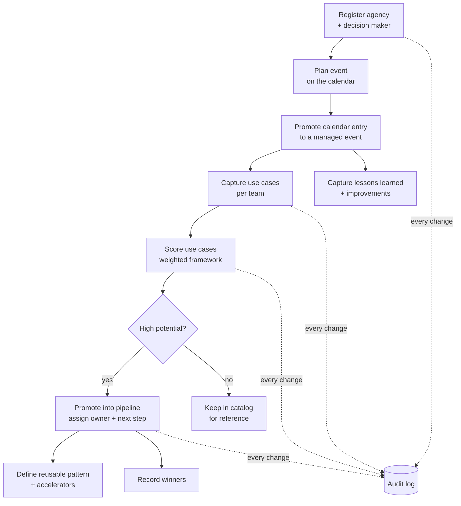
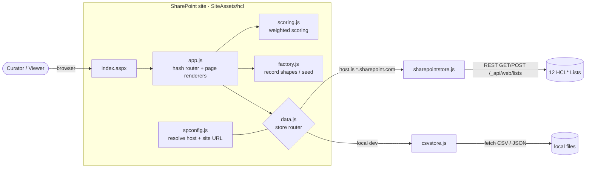
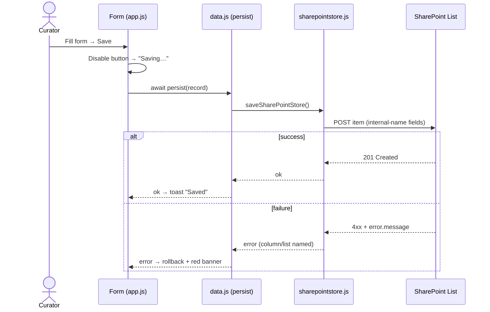
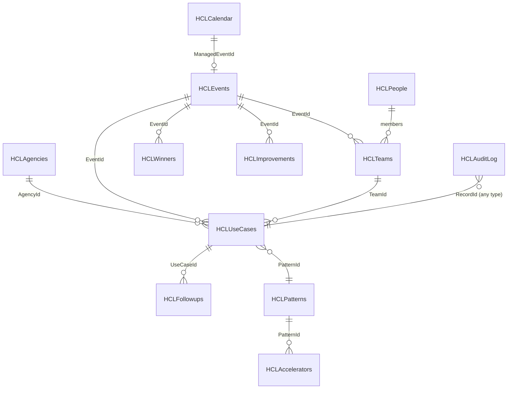

# Architecture &amp; Workflow

This document explains how the **Hackathon Content Library** is put together and how data flows
through it. All diagrams are [Mermaid](https://mermaid.js.org/) and render natively on GitHub.

---

## 1. Program workflow (end‑to‑end)

The library mirrors the lifecycle of running a SLED AI hackathon program:

---

## 2. Runtime architecture

The same JavaScript runs locally and on SharePoint. A single config module resolves the host and a
store router picks the persistence backend at runtime.

**Host detection** — [`spconfig.js`](../app/js/spconfig.js) treats any `*.sharepoint.com` origin as
SharePoint mode and derives the site (web) URL from the page path (trimming at the hosting library),
so REST calls always hit the correct `…/sites/<site>` web, never the tenant root.

---

## 3. Persistence &amp; the save path

Writes are **awaited** and surface real errors instead of optimistic "Saved" toasts.

> Reads/writes address columns by their **internal name** (e.g. `AgencyId`). This is why the Lists
> must be provisioned by [`provision-via-sitedesign.ps1`](../scripts/provision-via-sitedesign.ps1)
> (which sets internal names exactly) rather than "Import from CSV" (which mangles them).

---

## 4. Data model (Lists)

12 SharePoint Lists back the app. Records reference each other by string IDs.

| List | Holds |
|---|---|
| `HCLAgencies` | Customer agencies + primary decision maker |
| `HCLPeople` | Organizers, coaches, champions |
| `HCLEvents` | Managed hackathon events (full retro detail) |
| `HCLTeams` | Teams per event |
| `HCLUseCases` | Captured ideas + 9 scoring dimensions |
| `HCLPatterns` | Reusable solution patterns |
| `HCLAccelerators` | Assets attached to a pattern |
| `HCLCalendar` | Planned/upcoming events |
| `HCLImprovements` | Program improvement items |
| `HCLFollowups` | Post‑event follow‑ups per use case |
| `HCLWinners` | Event winners |
| `HCLAuditLog` | Central change trail (every create/edit/archive/restore/delete) |

Full column definitions are in [`../SharePoint_Deployment_Steps.md`](../SharePoint_Deployment_Steps.md) §4.

---

## 5. Scoring

Each use case is scored `0–3` on nine dimensions; [`scoring.js`](../app/js/scoring.js) computes a
weighted total and maps it to a band (e.g. **High Potential**). Scores are stored as plain text on
`HCLUseCases` and the band is computed in the browser, so the framework can be tuned without a data
migration.
